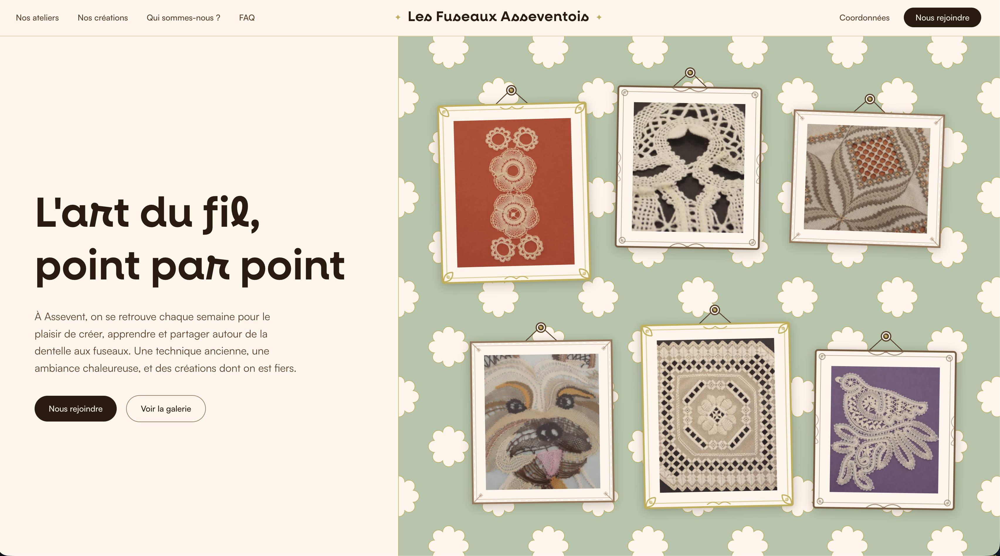

<p align="center">
  
</p>

<h1 align="center">Les Fuseaux Asseventois</h1>

<p align="center">
  <a href="https://nextjs.org/"></a>
  <a href="https://react.dev/"></a>
  <a href="https://www.typescriptlang.org/"></a>
  <a href="https://tailwindcss.com/"></a>
  <a href="https://gsap.com/"></a>
  <a href="https://www.framer.com/motion/"></a>
  <br />
  <a href="https://opensource.org/licenses/MIT"></a>
  <a href="https://fuseaux-asseventois.fr"></a>
</p>

<p align="center">
  Site vitrine de l'association <strong>Les Fuseaux Asseventois</strong>, un club de dentelle aux fuseaux basé à Assevent (Nord, Hauts-de-France).
</p>

---

## Stack technique

| Technologie | Version | Usage |
|---|---|---|
| [Next.js](https://nextjs.org/) | 16 | Framework React, App Router, SSR |
| [React](https://react.dev/) | 19 | UI components |
| [TypeScript](https://www.typescriptlang.org/) | 5 | Typage statique |
| [Tailwind CSS](https://tailwindcss.com/) | 4 | Styles utilitaires |
| [GSAP](https://gsap.com/) | 3.14 | Animations scroll (ScrollTrigger), timelines |
| [Framer Motion](https://www.framer.com/motion/) | 12 | Animations mount/unmount, hover, lightbox |
| [SplitType](https://github.com/lukePeavey/SplitType) | 0.3 | Animation lettre par lettre |
| [MapLibre GL](https://maplibre.org/) | 5 | Carte interactive (page contact) |


## Installation

```bash
# Cloner le repo
git clone https://github.com/toot7b/dentelle_project.git
cd dentelle_project

# Installer les dépendances
pnpm install

# Lancer le serveur de dev
pnpm dev
```

Le site est accessible sur [http://localhost:3000](http://localhost:3000).

## Structure du projet

```
src/
  app/
    layout.tsx              # Layout global, métadonnées SEO, JSON-LD
    page.tsx                # Page d'accueil (toutes les sections)
    globals.css             # Thème Tailwind v4, fonts, animations CSS
    icon.svg                # Favicon (étoile dorée SVG)
    robots.ts               # robots.txt auto-généré
    sitemap.ts              # sitemap.xml auto-généré
    adhesion/page.tsx       # Page adhésion
    contact/page.tsx        # Page contact avec carte
    mentions-legales/       # Mentions légales + RGPD
  components/
    Navbar.tsx              # Navigation fixe, desktop 3-col grid, mobile hamburger
    Hero.tsx                # Section hero : wallpaper floral, SplitType, 2 CTA
    PhotoWall.tsx           # Mur de 6 photos encadrées (absolu desktop, grid mobile)
    PhotoFrame.tsx          # Cadre SVG (3 variantes : baroque/classic/ornate)
    Footer.tsx              # Pied de page
    about/                  # Section "Qui sommes-nous" + photo encadrée
    activities/             # Section activités : clothesline, médaillons, nuages
    adhesion/               # Formulaire et contenu adhésion
    contact/                # Section CTA + page contact avec carte MapLibre
    faq/                    # FAQ accordéon
    galerie/                # Galerie 12 photos + lightbox plein écran
    transitions/            # Transitions de page (TransitionLink, TransitionWrapper)
public/
    photos/                 # Images WebP du site
    patterns/               # SVG décoratifs (flower.svg pour wallpaper)
    neulis/                 # Police Neulis (WOFF2 + TTF, 16 graisses)
```

## Sections de la page d'accueil

1. **Hero** -- Wallpaper floral 60% droite (desktop) / 65% bas (mobile), titre animé lettre par lettre avec SplitType, mur de 6 photos avec vis + fil + cadres SVG ornementaux
2. **Activités** -- 3 médaillons ovales suspendus à une clothesline (desktop) ou empilés avec clous (mobile), nuages SVG décoratifs
3. **Galerie** -- 12 photos "polaroid" sur fond vert, animation de chute au scroll, lightbox au clic avec blur
4. **À propos** -- Texte de présentation + grande photo encadrée dans un cadre classic, tapisserie florale en arrière-plan
5. **FAQ** -- Accordéon avec questions fréquentes
6. **Contact** -- CTA avec nuages décoratifs, liens vers adhésion et coordonnées

## Design

### Palette

| Couleur | Hex | Usage |
|---|---|---|
| Crème | `#FEF5EB` | Fond principal |
| Brun foncé | `#2C1A0E` | Texte principal |
| Brun moyen | `#5C3D26` | Texte secondaire |
| Or | `#C2AE4C` | Accents, cadres, ornements |
| Sable | `#E9BA85` | Décorations |
| Blush | `#F0DBD8` | Touches délicates |
| Vert | `#B2C5A8` | Fond galerie (wallpaper) |
| Brun muted | `#9A7558` | Éléments discrets |

### Typographies

- **Neulis** (serif) -- Titres et accents. Fichiers locaux dans `/public/neulis/` (WOFF2 + TTF, 16 graisses).
- **Satoshi** (sans-serif) -- Corps de texte. Chargé via [FontShare API](https://www.fontshare.com/fonts/satoshi).

### Ambiance

Artisanal, chaleureux, inspiré de la dentelle aux fuseaux. Chaque élément visuel (cadres, vis, fils, nuages, pissenlits) est dessiné en SVG.

## Animations

Le site utilise un système d'animations en deux couches pour éviter les conflits :

### GSAP + ScrollTrigger

- **PhotoWall** : timeline séquencée (vis pop -> cadre tombe -> fil s'étire -> rebond élastique)
- **Galerie** : photos tombent avec rotation aléatoire au scroll
- **Sections** : fade-in + translateY déclenchés au scroll
- **Mobile** : drop-in rapide + parallax léger en rotation

### Framer Motion

- **Hover** : swing sur les cadres (spring, stiffness 200, damping 12)
- **Lightbox** : overlay fade + contenu scale 0.93->1 + translateY
- **Transitions de page** : fade entre les routes

### CSS

- **Nuages** : 5 animations de drift (`cloud-drift-a` à `cloud-drift-e`)

### Règles importantes

- Ne **jamais** animer `y` via ScrollTrigger sur les cadres photo (casse le layout du wallpaper)
- **Séparer** intro (outer `data-frame`) et parallax (inner `data-parallax`) sur deux éléments distincts pour éviter les conflits GSAP sur `rotation`
- `fromTo` avec `scrub` peut forcer une valeur initiale et créer un saut visuel -> préférer `gsap.to` depuis 0
- **Mobile** : hover désactivé (`disableHover`), animations plus courtes, détection via `window.matchMedia("(max-width: 767px)").matches`

## SEO

- Métadonnées complètes : titre, description, keywords, OpenGraph, Twitter Cards, canonical URL
- JSON-LD Schema.org : `Organization` avec adresse, région, `areaServed` (Assevent + Maubeuge), `sameAs` (Facebook)
- JSON-LD Schema.org : `FAQPage` avec les 4 questions/réponses structurées (rich snippets Google)
- `robots.ts` et `sitemap.ts` auto-générés par Next.js App Router
- Alt descriptifs sur toutes les images (`"Dentelle aux fuseaux -- un arbre de fil"`)
- Métadonnées spécifiques par sous-page (adhésion, contact, mentions légales) avec canonical et OpenGraph dédiés
- Preconnect + DNS prefetch pour FontShare (chargement Satoshi optimisé)
- Géolocalisation : Assevent, Maubeuge, Hauts-de-France

## Responsive

Breakpoints clés : `md` = 768px, `lg` = 1024px.

| Élément | Desktop | Mobile |
|---|---|---|
| Navbar | 3 colonnes grid | Hamburger + dropdown |
| Hero wallpaper | 60% droite | 65% bas |
| PhotoWall | Positionnement absolu | Grid 2 colonnes |
| Activités | Clothesline horizontale | Empilé vertical + clous |
| Galerie | 3 colonnes | 1 colonne |
| Cadres hover | Swing actif | Désactivé |
| Animations | Timelines complètes | Plus rapides, simplifiées |

## Hébergement 100% européen

Ce projet est hébergé et opéré avec une infrastructure **intégralement européenne**, sans aucune dépendance aux cloud providers américains (AWS, Vercel, Cloudflare, etc.).

| Brique | Fournisseur | Pays |
|---|---|---|
| **VPS** | [Contabo](https://contabo.com/) | Allemagne |
| **Déploiement** | [Dokploy](https://dokploy.com/) | Self-hosted (open-source) |
| **Emails transactionnels** | [Sweego](https://www.sweego.io/) | France |
| **Nom de domaine** | [Infomaniak](https://www.infomaniak.com/) | Suisse |
| **DNS** | [Infomaniak](https://www.infomaniak.com/) | Suisse |

**Pourquoi ?** Souveraineté numérique, conformité RGPD native, pas de transfert de données hors UE, et soutien à l'écosystème tech européen.

### Headers de cache

Les headers de cache sont configurés dans `next.config.ts` pour les assets statiques :

| Ressource | Cache-Control | Durée |
|---|---|---|
| Images (WebP, SVG, PNG...) | `public, max-age=31536000, immutable` | 1 an |
| Polices Neulis (WOFF2, TTF) | `public, max-age=31536000, immutable` | 1 an |
| Patterns SVG | `public, max-age=31536000, immutable` | 1 an |
| Build output (`/_next/static/`) | Géré automatiquement par Next.js | Long-term |

Les assets statiques sont marqués `immutable` : le navigateur les sert depuis son cache sans revalider. Next.js gère le cache-busting via les hashes dans les noms de fichiers du build (`/_next/static/`).

## Variables d'environnement

```bash
# Sweego (envoi d'emails transactionnels)
SWEEGO_API_KEY=...

# Emails adhésion
ADHESION_TO_EMAIL=contact@example.fr      # Réception des demandes
ADHESION_FROM_EMAIL=contact@example.fr    # Adresse d'expédition
ADHESION_FROM_NAME=Les Fuseaux Asseventois # Nom d'expédition
```

## Scripts

```bash
pnpm dev       # Serveur de développement (http://localhost:3000)
pnpm build     # Build de production
pnpm start     # Serveur de production
pnpm lint      # ESLint
```

---

## Le Studio

Ce projet a été conçu et développé par **BigxBang Studio**, un studio de développement web et applicatif fondé par Thomas Sarazin, basé dans le nord de la France.

BigxBang est né d'une conviction simple : la tech européenne n'a rien à envier à personne, et il est temps de le prouver dans les faits. Son logo, un nuage en pixel art sous la pluie, ancre visuellement l'identité dans le nord de la France -- là où il pleut, là où on code.

### Ce que fait BigxBang

BigxBang conçoit des sites, des applications et des outils sur-mesure, du premier pixel au dernier octet déployé en production. Le studio ne se contente pas de livrer du code : il accompagne ses clients sur toute la chaîne, du développement à l'hébergement, en passant par l'architecture système et le scaling.

L'hébergement est un axe central. BigxBang déploie exclusivement sur des infrastructures européennes (Scaleway, Hetzner, Contabo) et donne au client un accès direct à ses propres serveurs. Pas de boîte noire, pas de dépendance fournisseur, pas de mauvaise surprise. Le client possède son code, accède à son hébergement, et garde les clés de tout son écosystème technique.

Le studio valorise aussi activement l'open-source et l'auto-hébergement, tant en interne que pour ses clients. Chaque brique choisie l'est pour sa pérennité, sa transparence et son indépendance vis-à-vis des grands acteurs du cloud.

### Principes fondamentaux

- **Le code appartient au client.** Pas de clause de rétention, pas de lock-in. Le code source est livré, documenté, et le client peut en faire ce qu'il veut.
- **Le client a son propre accès à l'hébergement.** Il peut se connecter à ses serveurs, consulter ses logs, gérer ses données. Le studio accompagne, mais ne contrôle pas.
- **Pas d'enfermement propriétaire.** Chaque décision technique est prise pour maximiser l'indépendance du client. Si le client veut changer de prestataire demain, il le peut sans friction.
- **Open-source privilégié.** Les solutions open-source sont systématiquement préférées aux alternatives propriétaires, sauf contre-indication technique majeure.
- **Posture de partenariat.** BigxBang n'est pas un prestataire qui disparaît après la livraison. C'est un partenaire technique qui reste disponible, qui suit l'évolution du projet, et qui transmet les compétences.

### L'idéologie -- Tech avec des valeurs européennes

L'Europe a déjà produit les fondations de la tech mondiale : Linux (Linus Torvalds, Finlande), Docker (Solomon Hykes, France), GitLab (Sytse Sijbrandij, Pays-Bas). Les talents sont là. Les outils sont là. La preuve que l'on peut construire de la tech de classe mondiale sans dépendre de la Silicon Valley existe déjà.

BigxBang s'inscrit dans cette continuité. L'axe central du studio est de faire de la tech avec des valeurs européennes -- souveraineté des données, transparence, respect de la vie privée, conformité RGPD native. Pas comme argument marketing. Comme posture de fond qui se traduit dans chaque décision technique, chaque choix d'infrastructure, et chaque relation client.

Ce projet en est un exemple concret : **zéro dépendance US** sur toute la chaîne (hébergement, emails, DNS, nom de domaine). Chaque brique est européenne, chaque donnée reste en Europe, et chaque prestataire partage les mêmes valeurs de transparence et de souveraineté.

Un petit easter egg trahit cette posture dans le footer du site : un Space Invaders en pixel art, clin d'oeil aux cloud providers américains qui envahissent le web européen.

---

## Licence

Code source disponible sous licence MIT.

Les contenus (textes, photos) restent la propriété exclusive de l'association Les Fuseaux Asseventois.

---

Design & Développement : **Thomas Sarazin** -- [BigxBang Studio](https://www.bigxbang.studio/)
